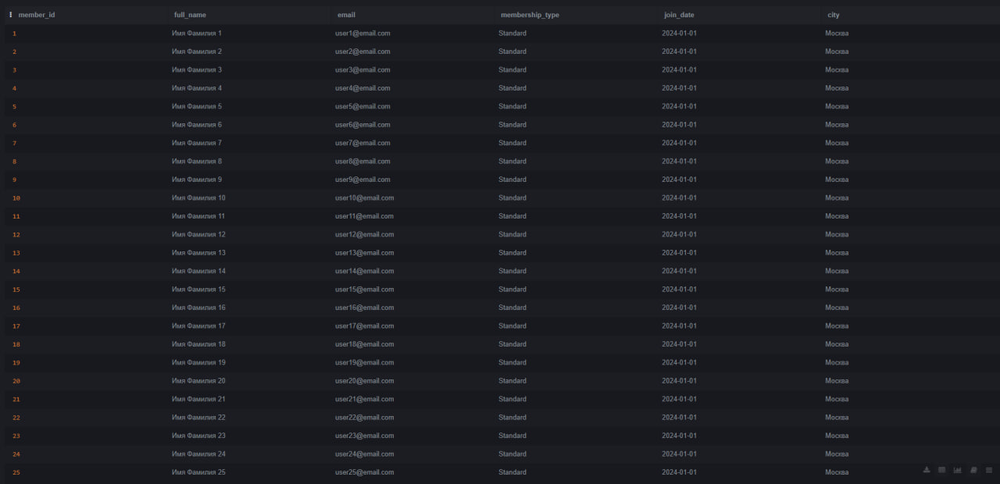
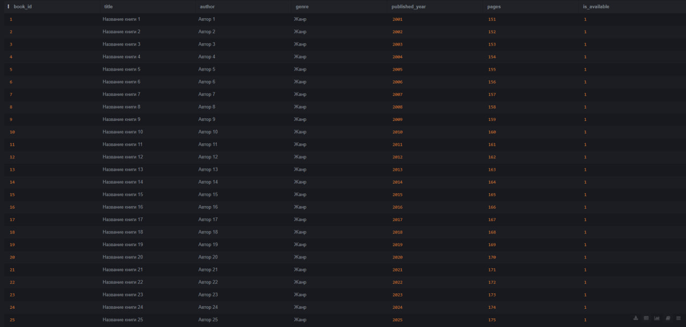
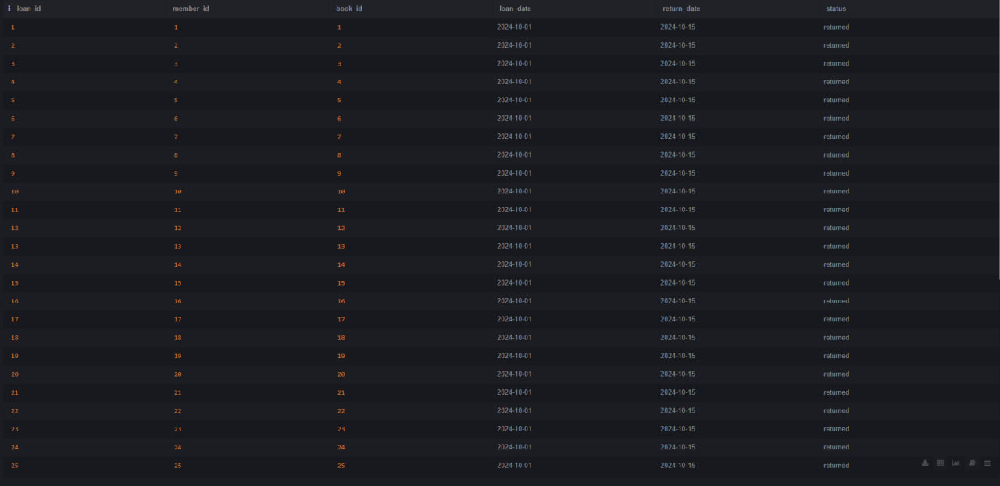

# Информатика. Практическая работа: Базы данных

Проект представляет собой систему управления **Онлайн-библиотекой**, разработанную на SQLite. База данных содержит информацию о читателях, книжном фонде и истории выдачи книг.

---

## 🛠 Технологии
* **Язык:** Python 3
* **БД:** SQLite
* **Инструменты:** SQLite Online, GitHub

---

## 📋 Структура базы данных

### Таблица `members` (Читатели)

| Поле | Тип | Описание |
| :--- | :--- | :--- |
| `member_id` | INTEGER | Уникальный идентификатор читателя (Primary Key) |
| `full_name` | TEXT | ФИО читателя |
| `email` | TEXT | Электронная почта (Unique) |
| `membership_type` | TEXT | Тип абонемента (Standard, Premium, Student) |
| `city` | TEXT | Город проживания |
| `join_date` | TEXT | Дата регистрации в системе |

### Таблица `books` (Книги)

| Поле | Тип | Описание |
| :--- | :--- | :--- |
| `book_id` | INTEGER | Уникальный идентификатор книги (Primary Key) |
| `title` | TEXT | Название книги |
| `author` | TEXT | Автор произведения |
| `genre` | TEXT | Жанр литературы |
| `published_year` | INTEGER | Год издания |
| `pages` | INTEGER | Количество страниц |

### Таблица `loans` (Заказы/Выдача)

| Поле | Тип | Описание |
| :--- | :--- | :--- |
| `loan_id` | INTEGER | ID записи выдачи (Primary Key) |
| `member_id` | INTEGER | ID читателя (Foreign Key к members) |
| `book_id` | INTEGER | ID книги (Foreign Key к books) |
| `loan_date` | TEXT | Дата выдачи книги |
| `return_date` | TEXT | Планируемая дата возврата |
| `status` | TEXT | Текущий статус (active, returned, overdue) |

---

## 🖼 Визуализация данных (SQLite Online)

Ниже представлены скриншоты каждой таблицы, содержащей по 30 записей, полученные с помощью запроса `SELECT * FROM название_таблицы`.

### Таблица Читателей

### Таблица Книг

### Таблица Выдачи

